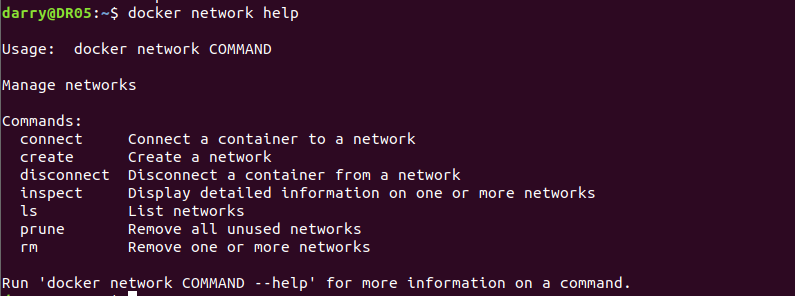
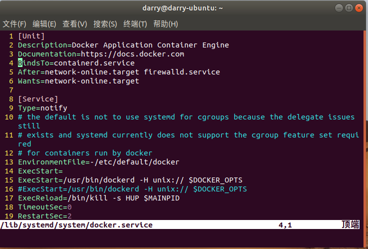

[TOC]

## 四、网络管理

> 网络管理模块不再重新操作，有些注意点，可能在新版本又会改变。这个后续再验证了。

<font color=red>注意：在自定义网络时候，有的dockers版本是-H fd://有的是 -H unix:// 具体的可以根据命令具体的可以根据命令 `ps aux |grep docker`查看</font>

### 1）： 端口映射详解

默认情况下，容器和宿主机之间网络是隔离的，我们可以通过端口映射的方式，将容器中的端口，映射到宿主机的
某个端口上。这样我们就可以通过宿主机的ip+port的方式来访问容器里的内容

#### 1.1）：Docker的端口映射

> 1. 随机映射 -P(大写)
> 2. 指定映射 -p 宿主机ip:宿主机端口:容器端口

注意： 生产场景一般不使用随机映射，但是随机映射的好处就是由docker分配，端口不会冲突, 不管哪种映射都会
有所消耗，影响性能，因为涉及到映射的操作

### 2）： 随机映射

#### 2.1）：默认随机映射

```shell
# 命令格式：
docker run -d -P [镜像名称]
# 命令效果：
# 先启动一个普通的nginx镜像
$ docker run -d nginx
# 查看当前宿主机开放了哪些端口
$ netstat -tnulp
```

```shell
# 启动一个默认随机映射的nginx镜像
$ docker run -d -P --name nginx02 nginx
# 查看当前宿主机开放了哪些端口
$ netstat -tnulp
```

在浏览器访问：http://192.168.0.12:32768/

#### 2.2）：指定主机随机映射

```shell
# 命令格式
docker run -d -p [宿主机ip]::[容器端口] --name [容器名称][镜像名称]
# 命令效果
$ docker run -d -p 192.168.0.12::80 --name nginx03 nginx
# 检查效果
$ docker ps
```

在浏览器访问：http://192.168.0.12:32769/

### 3）：指定映射

#### 3.1）：指定端口映射

```shell
# 命令格式：
docker run -d -p [宿主机ip]:[宿主机端口]:[容器端口] --name [容器名字][镜像名称]
# 注意：
# 如果不指定宿主机ip的话，默认使用 0.0.0.0，
# 命令实践：
# 现状我们在启动容器的时候，给容器指定一个访问的端口 1199
$ docker run -d -p 192.168.0.12:33587:80 --name nginx04 nginx
# 查看新容器ip
$ docker inspect --format='{{range .NetworkSettings.Networks}}{{.IPAddress}}
{{end}}' 0ad3acfbfb76
# 查看容器端口映射
$ docker ps
```

浏览器访问：http://192.168.0.12:33587/

#### 3.2）：指定多端口映射

```shell
# 命令格式
docker run -d -p [宿主机端口1]:[容器端口1] -p [宿主机端口2]:[容器端口2] --name [容器名
称][镜像名称]
# 开起多端口映射实践
$ docker run -d -p 36448:80 -p 36458:8989 -p 192.168.0.12:36676:80 --name nginx05 nginx
# 查看容器进程
$ docker ps
```

浏览器：http://192.168.0.12:36676/，http://192.168.0.12:36448/可以访问，http://192.168.0.12:36458/不能访问

### 4）：网络管理

#### 4.1）：docker网络命令

```shell
# 查看网络命令帮助
$ docker network help

# 命令说明
Commands:
  # 将一个容器连接到一个网络
  connect     Connect a container to a network
  # 创建一个网络
  create      Create a network
  # 从网络断开一个容器
  disconnect  Disconnect a container from a network
  # 在一个或多个网络上显示详细信息
  inspect     Display detailed information on one or more networks
  # 网络列表
  ls          List networks
  # 删除所有未使用的网络
  prune       Remove all unused networks
  # 删除一个或多个网络。
  rm          Remove one or more networks
```



#### 4.2）：经常使用的网络查看命令

```shell
# 查看当前主机网络
$ docker network ls

NETWORK ID          NAME                DRIVER              SCOPE
# 网络ID			  #网络名称			 # 网络驱动类型		   # 网络范围
c1c51d6733ea        bridge              bridge              local
7180247f3991        host                host                local
0550d79655fe        none                null                local
```

#### 4.3）：查看网络信息

```shell
$ docker network inspect bridge
```

#### 4.4）：查看容器详细信息

```shell
# 命令格式：
docker inspect [容器id]
# 命令效果：
查看容器全部信息:
$ docker inspect 930f29ccdf8a
查看容器网络信息:
$ docker inspect --format='{{range .NetworkSettings.Networks}}{{.IPAddress}}{{end}}' 930f29ccdf8a
```

#### 4.5）：查看容器端口信息

```shell
# 命令格式：
docker port [容器id]
# 命令效果：
$ docker port 930f29ccdf8a
```

### 5）：Docker网络模式

**docker的常用的网络模式**

#### 5.1）：bridge模式：

> 简单来说：就是穿马甲，打着宿主机的旗号，做自己的事情。 Docker的默认模式，它会在docker容
> 器启动时候，自动配置好自己的网络信息，同一宿主机的所有容器都在一个网络下，彼此间可以通信。类似于我们vmware虚拟机的桥接模式。 利用宿主机的网卡进行通信，因为涉及到网络转换，所以会造成资源消耗，网络效率会低。

#### 5.2）：host模式： 

> 简单来说，就是鸠占鹊巢，用着宿主机的东西，干自己的事情。容器使用宿主机的ip地址进行通信。
> 特点：容器和宿主机共享网络

#### 5.3）：container模式：

> 新创建的容器间使用，使用已创建的容器网络，类似一个局域网。 特点：容器和容器共享网络

#### 5.4）：none模式： 

> 这种模式最纯粹，不会帮你做任何网络的配置，可以最大限度的定制化。 不提供网络服务，容器启动
> 后无网络连接。

#### 5.5）：overlay模式：

> 容器彼此不再同一网络，而且能互相通行。


### 6）：定制bridge网络一

> - 创建桥接网络
> - 使用自定义网络创建容器
> - 容器断开、连接网络

#### 6.1）：创建网络

```shell
# 命令格式：
docker network create --driver [网络类型][网络名称]
# 参数
create 创建一个网络
--driver 指定网络类型
# 命令演示：
$ docker network create --driver bridge bridge-test
# 查看新建网络的网络信息
$ docker network inspect bridge-test

```

#### 6.2）：自定义网段与网关

```shell
# 自定义网段与网关
# 查看关于网段和网关的相关命令
$ docker network create --help
--gateway strings IPv4 or IPv6 Gateway for the master subnet
主子网的IPv4或IPv6网关。
--subnet strings Subnet in CIDR format that represents a network segment
表示网络段的CIDR格式的子网。

# 创建自定义网段与网关信息
$ docker network create --driver bridge --gateway 172.88.0.1 --subnet 172.88.0.0/18 bridge-test1
# 查看刚刚创建的网络信息
$ docker network inspect bridge-test1
```

#### 6.3）：在自定义网络中启动容器

```shell
# 命令格式：
docker run --net=[网络名称] -itd --name=[容器名称][镜像名称]
# 使用效果：
# 查看创建的网络bridge-test
$ docker network inspect bridge-test
"Containers": {},#容器是空的
# 查看创建的网络bridge-test1
$ docker network inspect bridge-test1
"Containers": {},#容器也是是空的
# 1、创建启动1个使用网络为bridge-test 名为nginx01的容器
$ docker run --net=bridge-test -itd --name nginx01 nginx
# 查看下容器
$ docker ps
#查看容器的信息
$ docker inspect nginx01

# 2、创建启动1个使用网络为bridge-test1 名为nginx02的容器
$ docker run --net=bridge-test1 -itd --name nginx02 nginx
# 查看下容器
$ docker ps

# 查看容器的信息
$ docker inspect nginx02
# 查看bridge-test的网络信息
$ docker network inspect bridge-test
# 查看bridge-test1的网络信息
$ docker network inspect bridge-test1

# 注意部分
# 使用默认的桥接模型创建的容器是可以直接联网的。
# 使用自定义的桥接模型创建的容器不可以直接联网，但是可以通过端口映射来实现联网
```

#### 6.4）：容器断开网络

```shell
# 命令格式：
docker network disconnect [网络名][容器名]
# 命令演示：
$ docker network disconnect bridge-test nginx01
# 查看下容器，nginx01的网络消失
$ docker ps

# 断开容器nginx02网络bridge-test1
$ docker network disconnect bridge-test1 nginx02
# 查看下容器，nginx02的网络消失
$ docker ps

# 分别查看网络bridge-test bridge-test1的网络
$ docker network inspect bridge-test
$ docker network inspect bridge-test1
# 发现容器内容消失
"Containers": {},#已经没有容器了

# 分别查看两个容器的信息发现容器网络信息消失
$ docker inspect nginx01
$ docker inspect nginx02
```

#### 6.5）：容器连接网络

```shell
# 命令格式：
docker network connect [网络名][容器名]
# 命令演示：
# 将容器nginx01连接到bridge-test1网络
$ docker network connect bridge-test1 nginx01
# 将容器ngin02连接到bridge-test网络
$ docker network connect bridge-test nginx02
# 查看容器
$ docker ps

# 查看bridge-test网络是否包含容器
$ docker network inspect bridge-test
# 查看bridge-test1网络是否包含容器
$ docker network inspect bridge-test1
```


### 7）：定制bridge网络二

之前创建的容器，它们的ip都是从docker0自动获取的，接下来定义一个br0网桥，然后启动的容器就
用这个

> 1. bridge-utils软件的brctl工具可以实现创建网桥 
> 2. 配置/etc/default/docker文件 编辑systemctl的配置文件使用该docker文件 重载systemctl配置 重启docker 
> 3. 创建容器，查看容器信息即可

**配置方案一**

下面第三点是重点，下面还有配置方案二

```shell
# 1、网桥环境部署
    # 1.1 网桥软件部署
    # ubuntu默认不自带网桥管理工具，安装网桥软件
$	sudo apt-get install bridge-utils -y
# 查看网卡
$ brctl show
	# 1.2 创建网桥
	sudo brctl addbr br0
# 给网桥设置网段
$ sudo ifconfig br0 192.168.99.1 netmask 255.255.255.0
# 查看ip信息
$ ifconfig
# 查看配置前进程
$ ps aux |grep docker
# 2、docker配置网桥
    # 2.1 配置docker文件，有的系统没有这个文件，则新建一个
$     sudo vim /etc/default/docker
    # 最末尾添加
    DOCKER_OPTS="-b=br0"
# 3、这里是重点，也就是区别有问题系统的地方了
	# 编辑docker.service配置文件
$ 	sudo vim /lib/systemd/system/docker.service

# =========配置前的内容==========
ExecStart=/usr/bin/dockerd -H unix://
ExecReload=/bin/kill -s HUP $MAINPID
TimeoutSec=0
RestartSec=2
Restart=always
# =========配置后的内容==========
EnvironmentFile=-/etc/default/docker
ExecStart=
ExecStart=/usr/bin/dockerd -H unix:// $DOCKER_OPTS
#ExecStart=/usr/bin/dockerd -H unix:// $DOCKER_OPTS
ExecReload=/bin/kill -s HUP $MAINPID
TimeoutSec=0
RestartSec=2
Restart=always

对比图在下面

# 重启Docker服务 
$ systemctl restart docker
# 查看配置后进程
$ ps aux |grep docker
# 3、容器测试
    # 3.1 创建容器并测试
    # 创建默认网络的容器
$   docker run -itd --name nginx03 nginx
  	# 3.2 查看信息已经使用了br0的网卡的网络
$ 	docker inspect 92d4b5e434d2
	# 3.3 查看网络下的容器
$ 	docker network inspect bridge
	
```

配置前


配置后




<font color=red>注意：下面配置，有的版本是-H fd://有的是 -H unix:// 具体的可以根据命令 `ps aux |grep docker`查看</font>

> ExecStart=/usr/bin/dockerd -H fd:// $DOCKER_OPTS
>
> ExecStart=/usr/bin/dockerd -H unix:// $DOCKER_OPTS

```shell
# 1、网桥环境部署
    # 1.1 网桥软件部署
    # ubuntu默认不自带网桥管理工具，安装网桥软件
    sudo apt-get install bridge-utils -y
    #查看网卡
    brctl show
    #1.2 创建网桥
    sudo brctl addbr br0
    brctl show

# 给网桥设置网段
sudo ifconfig br0 192.168.99.1 netmask 255.255.255.0
ifconfig

# 2、docker配置网桥
    # 2.1 配置docker文件,我的这个目录下没有这个文件，要新建，方案是上面那个
    sudo vim /etc/default/docker
    # 最末尾添加
    DOCKER_OPTS="-b=br0"
    # 2.2 systemctl使用docker文件
    # 创建服务依赖文件
    sudo mkdir -p /etc/systemd/system/docker.service.d
    sudo vim /etc/systemd/system/docker.service.d/Using_Environment_File.conf
    # 内容如下：
    [Service]
    EnvironmentFile=-/etc/default/docker
    ExecStart=
    ExecStart=/usr/bin/dockerd -H fd:// $DOCKER_OPTS
      
    # 重载服务配置文件
    systemctl daemon-reload

    # 2.3 重启docker
    # 重启前效果
    ps aux |grep docker
    # 重启
    systemctl restart docker
    # 重启后效果
    ps aux |grep docker

# 3、容器测试
    # 3.1 创建容器并测试
    # 创建默认网络的容器
    docker run -itd --name nginx--3 nginx
    docker ps
    # 查看信息已经使用了br0的网卡的网络
    docker inspect 92d4b5e434d2
```


### 8）：Host网络配置

容器使用宿主机的ip地址进行对外提供服务，本身没有ip地址。

```shell
# 命令格式：
docker run --net=host -itd --name [容器名称] 镜像名称
# 命令示例：
# 查看下网络情况
$ docker network ls
    # 查看host下有哪些容器
$   docker network inspect host
    # 发现是空的
    "Containers": {}
# 查看宿主机启动网络
$ netstat -tnulp
# 发现没有80端口
# 1、根据host网络创建启动容器
$ docker run --net=host -itd --name nginx01 nginx

# 发现没有端口映射
$ docker ps
    # 查看宿主机启动网络
$   netstat -tnulp
    # 多出了80端口
$   tcp 0 0 0.0.0.0:80 0.0.0.0:* LISTEN -
# 查看host下有哪些容器
$ docker network inspect host
```

**host特点：** 

> host模型比较适合于，一台宿主机跑一个固定的容器，比较稳定，或者一个宿主机跑多个占用不同端
> 口的应用的场景，他的网络性能是很高的。
>
> host模型启动的容器不会有任何地址，他其实是使用了宿主机的所有信息


### 9）：None网络配置-自定义桥接网络

<font color=red>**注意、注意、注意前方高能**</font>

<font color=red>**请切换虚拟机网络连接为NAT，不要使用桥接模式**</font>

> 配置自定义桥接网络：为了使本地网络中和Docker容器更方便的通信，我们经常会有将Docker容器配置到和主机同一网段，而且还要指定容器的ip地址。

**需求：** 自定义容器网络和宿主机为同一网段，容器ip可以指定。

> 1. 自定义容器网络段和宿主机一样
> 2. 自定义容器ip地址： 

#### 9.1）：网络配置

docker虚拟网桥配置
docker服务使用网桥
容器创建使用none模式

#### 9.2）：使用pipwork工具实现定制docker容器ip地址

```shell
注释：pipwork的命令格式
pipework 桥接设备 [容器ip]/[ip掩码]@[宿主机网关]
例子：
$ pipework br0 ubuntu-test1 192.168.8.201/24@192.168.8.2
```

#### 9.3）：映射虚拟机软件源进入到容器，替换掉容器内部软件源后进行软件源更新与安装

注释：docker上pull下来的Ubuntu,使用apt-get install 命令下载速度奇慢无比,需要修改其软件源,进入etc/apt
目录欲修改sources.list 发现vi,vim,gedit都没有,再下这些软件也非常慢.
解决方法：

> 3.1. 启动容器时,挂载本地Linux系统的etc/apt文件
> ​	docker run -ti -v /etc/apt/:/home/etc ubuntu
> 3.2 删除容器下的sources.lis rm /etc/apt/sources.list
> 3.3 将本地sources.list 复制过来 cp /home/etc/sources.list /etc/apt/

#### 9.4）：方案实施

<font color=red>**注意、注意、注意前方高能**</font>

**DNS解决方案一**

```shell
# 修改文件，找到对应的注释打开，并配置
$ sudo vim /etc/systemd/resolved.conf
[Resolve]
DNS=1.1.1.1 1.0.0.1
LLMNR=no
# 退出文件，重新启动加载
$ sudo systemctl restart systemd-resolved
```

**DNS解决方案：这个为临时解决方案，后面有注意事项一定要看**

```shell
# 先停止服务
$ sudo systemctl stop systemd-resolved 
# 修改文件
$ sudo vim /etc/resolv.conf
# 增加内容
nameserver 8.8.8.8
nameserver 223.5.5.5
nameserver 223.6.6.6
nameserver 199.29.29.29
nameserver 114.114.114.114
# 注意如果重启后网络并未生效
$ sudo /etc/init.d/networking restart 
# 注意：千万不要重启虚拟机，也千万不要执行方案一的重新启动加载命令，否则文件又会还原，这是个大坑
```

<font color=red>**ubuntu18.04虚拟机，要采用下面方式设置**</font>

```shell
# 1、网桥环境部署
    # 1.1 网桥软件部署
    # ubuntu默认不自带网桥管理工具，安装网桥软件
$   sudo apt-get install bridge-utils -y
    # 查看网卡
$   brctl show
   
# 1.1.2 桥接网卡配置
# 编辑网卡信息编辑Ubuntu的网卡信息文件
# 对源文件进行备份
$ sudo cp /etc/network/interfaces /etc/network/interfaces-old
$ sudo vim /etc/network/interfaces
# 与源文件内容进行1行的空行
auto br0
iface br0 inet static
address 192.168.0.20 # 网卡ip跟宿主机的ip区分开
netmask 255.255.255.0
gateway 192.168.0.1
dns-nameservers 114.114.114.114
bridge_ports ens33
# 重启
$ service networking restart

# 配完上面这步就要验证域名解析是否正常了，解析不了（用上面两种方案）
# 验证dns解析是否正常
$ ping www.baidu.com
# 网络可能会没有dns解析所以我们需要进行dns的配置
	# 16.04：
$ 	sudo vim /etc/resolvconf/resolv.conf.d/base
	# 18.04：
$ 	sudo vim /etc/resolv.conf
# 配置完了重启网络，成功了就是绿色的ok，失败了可能就有问题
$ sudo /etc/init.d/networking restart

# 2、docker配置网桥
    # 2.1 配置docker文件，有的系统没有这个文件，则新建一个
$   sudo vim /etc/default/docker
    # 最末尾添加
    DOCKER_OPTS="-b=br0"
# 3、这里是重点，也就是区别有问题系统的地方了
	# 编辑docker.service配置文件
$ 	sudo vim /lib/systemd/system/docker.service

# =========配置前的内容==========
ExecStart=/usr/bin/dockerd -H unix://
ExecReload=/bin/kill -s HUP $MAINPID
TimeoutSec=0
RestartSec=2
Restart=always
# =========配置后的内容==========
EnvironmentFile=-/etc/default/docker
ExecStart=
ExecStart=/usr/bin/dockerd -H unix:// $DOCKER_OPTS
# ExecStart=/usr/bin/dockerd -H unix:// $DOCKER_OPTS
ExecReload=/bin/kill -s HUP $MAINPID
TimeoutSec=0
RestartSec=2
Restart=always

# 重载服务配置文件
$ ps aux |grep docker
$ sudo systemctl daemon-reload
# 重启docker第一次配置的时候需要重启linux虚拟机：reboot
$ sudo systemctl restart docker
# 重启后效果，跟重启前对比
$ ps aux |grep docker

```

**容器创建测试**

```shell
# 1、基于ubuntu镜像创建一个容器，网络模式使用none ，启动容器时,挂载本地Linux系统的etc/apt文件
$ docker run -itd --net=none --name ubuntu01 -v /etc/apt/:/home/etc ubuntu /bin/bash
$ docker ps

# 2、定制容器ip
# 2.1 pipwork软件部署
# 安装pipwork
    # 方法1：
$   git clone https://github.com/jpetazzo/pipework
    # 方法2：将软件直接拖入ubuntu虚拟机
    # 直接解压安装包
$   unzip pipework-master.zip
    # 将文件拷贝到bin下，这里如果是用git获取的文件，则要看下对应的目录
$   sudo cp pipework-master/pipework /usr/local/bin/
    # 2.2 定制容器ip，ip地址要跟自己虚拟机同一个网段
$   sudo pipework br0 ubuntu01 192.168.0.21/24@192.16.0.1
# 2.3 测试效果
# 进入容器查看ip地址信息
$ docker exec -it ubuntu01 /bin/bash

# ====== 以下是在容器里面操作，下面的源可以先不操作，直接先更新 ========
# 删除容器下的sources.lis 
:~# rm /etc/apt/sources.list
# 将本地sources.list 复制过来
:~# cp /home/etc/sources.list /etc/apt/
# 进行软件源更新
:~# apt-get update
# 安装ping命令
:~# apt-get install inetutils-ping -y
# 安装ifconfig命令
:~# apt-get install net-tools -y

宿主机ping命令测试
$ ping 192.168.0.21
```


### 10）：跨主机容器通信

均安装 bridge-utils软件

**主机信息：**
主机1：ubuntu 18.04 192.168.0.20
主机2：ubuntu 18.04 192.168.0.30

#### 10.1）：分析： 

> 1. 自定义br0
> 2. docker服务使用br0
> 3. 创建容器使用br0
> 4. 跨主机间网络测试

#### 10.2）：知识点： 

> 1. 使用手工方式定制ubuntu的网卡
> 2. 配置/etc/default/docker文件
>    编辑systemctl的配置文件使用该docker文件
>    重载systemctl配置
>    重启docker或者重启虚拟机
> 3. 创建容器，查看容器信息即可
> 4. 两台主机分别测试

<font color=red>注意： 1、2、3 这三条在两台主机的配置大部分一模一样 ip地址划分不一样</font>

#### 10.3）：解决方案： 

> 1. ubuntu桥接网卡配置
>    1. 软件安装
>    2. 编辑网卡
> 2. docker配置网桥
>    1. 配置docker文件
>    2. systemctl使用docker文件
>    3. 重启主机
> 3. 容器测试
>    1. 创建容器
>    2. 容器间测试

#### 10.4）：方案实施：

##### **1 、ubuntu桥接网卡配置**

```shell
# 1、ubuntu桥接网卡配置
    # 1.1 软件安装
$   apt-get install bridge-utils -y
    # 1.2 ，备份网卡、编辑网卡
$   sudo cp /etc/network/interfaces /etc/network/interfaces-old
$   sudo vim /etc/network/interfaces
    # 与文件源内容进行1行的空行
	# 主机1
        auto br0
        iface br0 inet static
        address 192.168.0.20
        netmask 255.255.255.0
        gateway 192.168.0.1
        dns-nameservers 114.114.114.114
        bridge_ports ens33
    # 主机2
        auto br0
        iface br0 inet static
        address 192.168.0.30
        netmask 255.255.255.0
        gateway 192.168.0.1
        dns-nameservers 114.114.114.114
        bridge_ports ens33
    # 重启
$ 	service networking restart
    # 验证dns解析是否正常，解析不了找上面 9）方案
$ 	ping www.baidu.com
```

##### **2、docker配置网桥**

<font color=red>注意：下面配置，有的dockers版本是-H fd://有的是 -H unix:// 具体的可以根据命令具体的可以根据命令 `ps aux |grep docker`查看</font>

> ExecStart=/usr/bin/dockerd -H fd:// $DOCKER_OPTS
>
> ExecStart=/usr/bin/dockerd -H unix:// $DOCKER_OPTS

```shell
# 2、docker配置网桥
# 2.1 配置docker文件
# 修改docker的守护进程文件
$ sudo vim /etc/default/docker
# 末尾添加:
# 主机1
DOCKER_OPTS="-b=br0 --fixed-cidr=192.168.0.99/26"
# 主机2
DOCKER_OPTS="-b=br0 --fixed-cidr=192.168.0.170/26"
# 注释：
# -b 用来指定容器连接的网桥名字
# --fixed-cidr用来限定为容器分配的IP地址范围
# 192.168.0.99/26地址范围：192.168.0.64~192.168.0.127
# 192.168.0.170/26地址范围：192.168.0.128~192.168.0.191
# 网段的计算可以参考网址：http://tool.520101.com/wangluo/ipjisuan/

# 这里废弃了，这里是重点，也就是区别有问题系统的地方了
	# 编辑docker.service配置文件
	# sudo vim /lib/systemd/system/docker.service

# 3、systemctl使用docker文件
# 创建服务依赖文件
$   sudo mkdir -p /etc/systemd/system/docker.service.d
$   sudo vim /etc/systemd/system/docker.service.d/Using_Environment_File.conf
# 内容如下：
[Service]
EnvironmentFile=-/etc/default/docker
ExecStart=
ExecStart=/usr/bin/dockerd -H unix:// $DOCKER_OPTS

# 重载服务配置文件
$ ps aux |grep docker
$ sudo systemctl daemon-reload
# 重启docker第一次配置的时候需要重启linux虚拟机：reboot
$ sudo systemctl restart docker
# 重启后效果，跟重启前对比
$ ps aux |grep docker
```

##### **3、创建容器测试**

```shell
#3.1 创建容器
# 主机1：
$ docker run -itd --name ubuntu01 -v /etc/apt/:/home/etc ubuntu /bin/bash
$ docker run -itd --name ubuntu02 -v /etc/apt/:/home/etc ubuntu /bin/bash
# 主机2
$ docker run -itd --name ubuntu03 -v /etc/apt/:/home/etc ubuntu /bin/bash
$ docker run -itd --name ubuntu04 -v /etc/apt/:/home/etc ubuntu /bin/bash
# 3.2 容器间测试
进入容器
# 主机1
$ docker exec -it ubuntu01 /bin/bash
$ docker exec -it ubuntu02 /bin/bash
# 主机2
$ docker exec -it ubuntu03 /bin/bash
$ docker exec -it ubuntu04 /bin/bash
# ========= 下面命令是进入容器执行，下面的源可以先不操作，直接先更新=========
:~# rm /etc/apt/sources.list
# 容器内部将本地sources.list 复制过来
:~# cp /home/etc/sources.list /etc/apt/
# 容器内部进行软件源更新
:~# apt-get update
# 容器内部安装ping命令
:~# apt-get install inetutils-ping -y
# 容器内部安装ifconfig命令
:~# apt-get install net-tools -y

# 宿主机ping命令测试
> ping 192.168.0.20
> ping 192.168.0.30
# 各个容器之间相互通信
```

