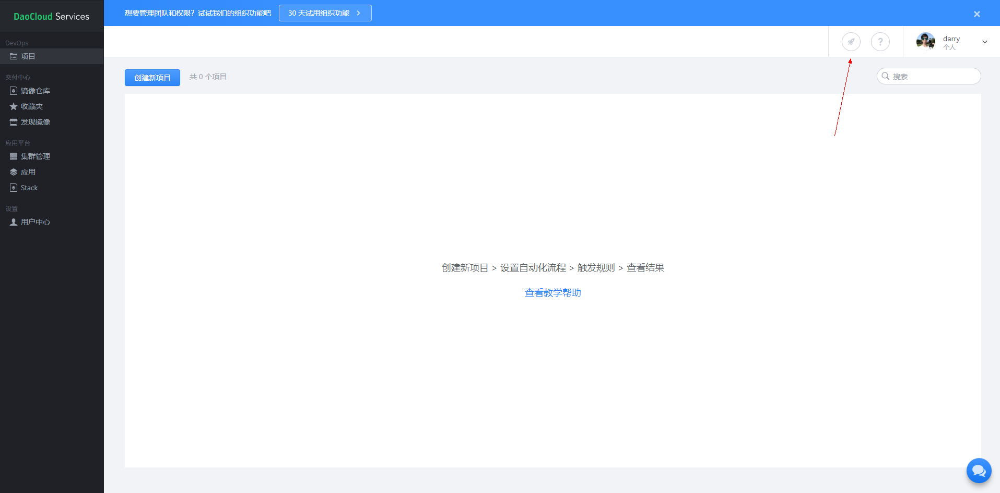
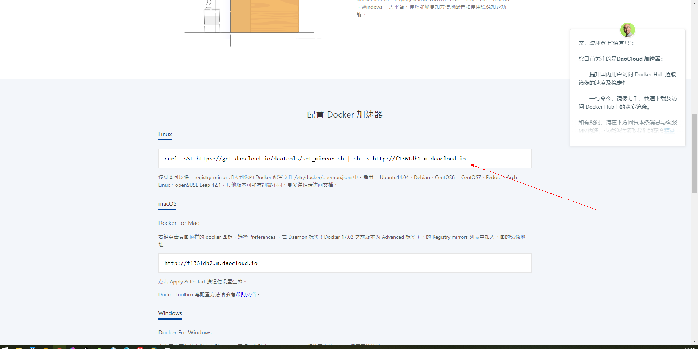

[TOC]

## 一、Docker安装

**Linux查看历史输入命令**

```shell
history
```

### 1、查看Ubuntu环境要求

Docker要求Ubuntu系统内核版本高于3.10

```shell
uname -a
ls -l /sys/class/misc/device-mapper
```

### 2、安装部署Docker

以下命令按顺序直接复制到命令窗口，执行就可以。

```shell
# 更新软件源
sudo apt-get update
sudo apt-get -y install apt-transport-https ca-certificates curl software-properties-common
# 安装GPG证书
sudo curl -fsSL http://mirrors.aliyun.com/docker-ce/linux/ubuntu/gpg | sudo apt-key add -
# 写入软件源
sudo add-apt-repository "deb [arch=amd64] http://mirrors.aliyun.com/docker-ce/linux/ubuntu $(lsb_release -cs) stable"

# 再次更新软件源
sudo apt-get update
# 安装Docker，不想安装最新版本可以先查看对应有哪些版本，然后安装指定版本
sudo apt-get -y install docker-ce

# 1、查看支持的Docker版本
apt-cache madison docker-ce

# 2、安装指定版本的Docker-CE:
sudo apt-get -y install docker-ce=18.03.1~ce~3-0~ubuntu

```

#### 2.1 验证Docker安装

```shell
docker version
```

### 3、删除Docker

```shell
sudo apt-get purge docker-ce -y
sudo rm -rf /etc/docker
sudo rm -rf /var/lib/docker/
sudo apt-get remove --auto-remove docker 
```

### 4、Docker目录简介

```shell
/etc/docker				# docker的认证目录
/var/lib/docker/		# docker的应用目录
```

### 5、Docker加速器

> <font color=red>安装的Docker 18.09.4版本发现设置下面的加速器已经没用了</font>

在国内使用docker的官方镜像源，会因为网络的原因，造成无法下载，或者一直处于超时。所以我们使用
daocloud的方法进行加速配置。 加速器文档链接：http://guide.daocloud.io/dcs/daocloud-9153151.html

**方法：**

访问 https://dashboard.daocloud.io 网站，登录 daocloud 账户

注册登录后

点击下图位置，会开启一个新的链接界面





#### 5.1 加速器配置

```shell
curl -sSL https://get.daocloud.io/daotools/set_mirror.sh | sh -s http://f1361db2.m.daocloud.io

# 修改 /etc/docker/daemon.json 文件，增加
$ sudo vim /etc/docker/daemon.json

, "insecure-registries": []
# 到大括号后

# cat /etc/docker/daemon.json
{"registry-mirrors": ["http://e5d212cc.m.daocloud.io"], "insecure-registries": []}
# 注意：
# docker cloud加速器的默认内容是少了一条配置，所以我们要编辑文件把后面的内容补全
# 重启docker
systemctl restart docker
```

### 6、Docker命令权限解决

#### 1）：一冷性解决

```shell
# 如果还没有 docker group 就添加一个：
sudo groupadd docker
# 将用户加入该 group 内。然后退出并重新登录就生效啦。
sudo gpasswd -a ${USER} docker
# 重启 docker 服务
systemctl restart docker
# 切换当前会话到新 group 或者重启 X 会话
newgrp - docker
# 注意:最后一步是必须的，否则因为 groups 命令获取到的是缓存的组信息，刚添加的组信息未能生效，
# 所以 docker images 执行时同样有错。
```

#### 2）：每次登录或重启配置

```shell
# 每次启动docker或者重启docker的之后
cd /var/run
sudo chmod 666 docker.sock
```


