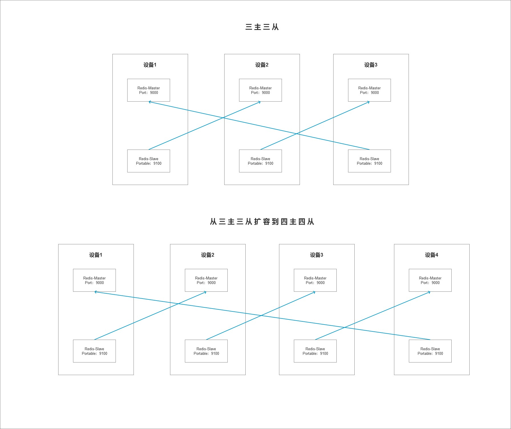

# CentOS 7.6 系统 Redis 集群搭建

[TOC]


## 一、Redis 集群架构图

> 主节点的端口全为：9000
>
> 从节点的端口全为：9100



## 二、Redis 下载安装

```shell
# 下载
$ wget http://download.redis.io/releases/redis-5.0.6.tar.gz

# 解压
$ tar -zxvf redis-5.0.6.tar.gz
$ cp -r ./redis-5.0.6 ./redis
$ rm -rf ./redis-5.0.6

# 编译安装需要gcc环境
$ yum -y install gcc-c++

# 编译安装
$ cd /data/redis
$ make

# ===============
# 如果之前有编译报错先下载编译环境，然后把之前的遗留编译清了
$ make distclean
$ make

# 也可以先预编译下
$ make test

```

## 三、Redis 集群配置文件

### 3.1、Redis 配置文件基本配置

```shell
# 以守护进程模型启动
daemonize yes

# 绑定主机地址（访问的主机地址，多个主机用空格分开）
bind 127.0.0.1

# Redis的监听端口（默认6379）
port 6379

# Pid文件和log的文件保存地址（以下为默认地址，log文件地址默认为空）
pidfile /var/run/redis_6379.pid
logfile ""

# 设置数据库的数量，默认数据库为0
databases 16

# 指定本地持久化文件的文件名（默认是dump.rdb）
 dbfilename dump.rdb

# 本地数据库的目录(以下为默认目录)
dir ./
```

### 3.2、Redis 的基本操作

```shell 
# 1、查看所有key（线上环境严禁使用）
keys *

# 2、查看键的总数（直接获取Redis内置的键总数变量）
dbsize

# 3、检查键是否存在（存在返回1，不存在返回0）
exists key

# 4、删除key（不限类型）
del key

# 5、设置key过期
expire key seconds

# 6、查看键过期时间
ttl key

# 7、查看key的数据类型
type key

```

### 3.3、Redis 集群的配置

```shell
# 创建软件配置目录和Redis数据目录
$ mkdir -p /data/reids_cluster/redis_{9000,9100}/{conf,data,logs,pid}

$ vim /data/redis_cluster/redis_9000/conf/redis-master-9000.conf
# Redis master 主节点配置

bind 0.0.0.0
port 9000
daemonize yes
pidfile "/data/redis_cluster/redis_9000/pid/redis-master-9000.pid"
logfile "/data/redis_cluster/redis_9000/logs/redis-master-9000.log"
dir "/data/redis_cluster/redis_9000/data"
dbfilename "redis-master-9000.rdb"
cluster-enabled yes
cluster-config-file "/data/redis_cluster/redis_9000/conf/nodes-master-9000.conf"
cluster-node-timeout 15000

# 加id绑定需要再验证一遍

bind 192.168.129.137
port 9000
daemonize yes
pidfile "/data/redis_cluster/redis_9000/pid/redis-master-9000.pid"
logfile "/data/redis_cluster/redis_9000/logs/redis-master-9000.log"
dir "/data/redis_cluster/redis_9000/data/"
dbfilename "redis-master-9000.rdb"
cluster-enabled yes
cluster-config-file "/data/redis_cluster/redis_9000/conf/nodes-master-9000.conf"
cluster-node-timeout 15000

$ vim /data/redis_cluster/redis_9100/conf/redis-slave-9100.conf
# Redis Slave 从节点配置（从主节点上复制一份配置，修改对应的参数）

bind 0.0.0.0 
port 9100
daemonize yes
pidfile "/data/redis_cluster/redis_9100/pid/redis-slave-9100.pid"
logfile "/data/redis_cluster/redis_9100/logs/redis-slave-9100.log"
dbfilename "redis-slave-9100.rdb"
dir "/data/redis_cluster/redis_9100/data/"
cluster-enabled yes
cluster-config-file "/data/redis_cluster/redis_9100/conf/nodes-slave-9100.conf"
cluster-node-timeout 15000

# 加ip绑定需要再验证一遍
bind 192.168.129.137
port 9100
daemonize yes
pidfile "/data/redis_cluster/redis_9100/pid/redis-slave-9100.pid"
logfile "/data/redis_cluster/redis_9100/logs/redis-slave-9100.log"
dbfilename "redis-slave-9100.rdb"
dir "/data/redis_cluster/redis_9100/data/"
cluster-enabled yes
cluster-config-file "/data/redis_cluster/redis_9100/conf/nodes-slave-9100.conf"
cluster-node-timeout 15000

```

### 3.4、启动Redis

```shell
# 启动master的Redis
./data/redis/src/redis-server ./data/redis_cluster/redis_9000/conf/redis-master-9000.conf

# 启动Slave的Redis
./data/redis/src/redis-server ./data/redis_cluster/redis_9100/conf/redis-slave-9100.conf 

# 查看Redis的启动信息
$ ps -ef | grep redis
root      70832      1  0 21:12 ?        00:00:00 ./data/redis/src/redis-server 192.168.129.137:9000 [cluster]
root      70856      1  1 21:12 ?        00:00:00 ./data/redis/src/redis-server 192.168.129.137:9100 [cluster]
root      70861  67679  0 21:12 pts/1    00:00:00 grep --color=auto redis

# 查看集群配置文件名连接进Redis 查看节点信息
$ cat ./data/redis_cluster/redis_9000/conf/nodes-master-9000.conf 
b2fd1bb95b224763ebef88d6958240819c559ecb :0@0 myself,master - 0 0 0 connected
vars currentEpoch 0 lastVoteEpoch 0 

$ ./data/redis/src/redis-cli -h 192.168.129.137 -p 9000
192.168.129.137:9000> cluster nodes
b2fd1bb95b224763ebef88d6958240819c559ecb :9000@19000 myself,master - 0 0 0 connected

```

### 3.5、其它机器的配置

```shell
# 将整个文件夹复制到远程机器上
$ scp -r ./redis_cluster root@192.168.129.134:/data/

# 如果配置文件没问题，可以在上面没启动redis之前将文件夹复制到别的机器，可以省去删文件操作
# 将第一台机器启动的相关文件删除
rm /data/redis_cluster/redis_9000/conf/nodes-master-0000.conf
rm /data/redis_cluster/redis_9100/conf/nodes-slave-9100.conf 
rm /data/redis_cluster/redis_9000/logs/redis-master-9000.log
rm /data/redis_cluster/redis_9100/logs/redis-slave-9100.log
rm /data/redis_cluster/redis_9000/pid/redis-master-9000.pid
rm /data/redis_cluster/redis_9100/pid/redis-slave-9100.pid 

# 将复制过去的配置文件redis-master-9000.conf和redis-slave-9100.conf中的ip修改掉
# 一定要记得将复制过去的配置文件bind对应的ip改掉
bind 192.168.129.134

# 修改文件后并启动对应机器的redis
```

### 3.6、创建集群

```shell
./redis-cli --cluster create 192.168.129.137:9000 192.168.129.134:9000 192.168.129.135:9000 192.168.129.137:9100 192.168.129.134:9100 192.168.129.135:9100 --cluster-replicas 1

# 创建的时候局域网会有防火墙问题（下面的ip需要改为实际的和开放端口号）
# 下面这些命令在每台机器都执行一遍
iptables -N REDIS
iptables -A REDIS -s 192.168.129.137 -j ACCEPT
iptables -A REDIS -s 192.168.129.134 -j ACCEPT
iptables -A REDIS -s 192.168.129.135 -j ACCEPT
iptables -A REDIS -j LOG --log-prefix "unauth-redis-access"
iptables -A REDIS -j REJECT --reject-with icmp-port-unreachable
iptables -I INPUT -p tcp --dport 9000 -j REDIS
iptables -I INPUT -p tcp --dport 9100 -j REDIS
iptables -I INPUT -p tcp --dport 19000 -j REDIS
iptables -I INPUT -p tcp --dport 19100 -j REDIS

# 查看集群信息
$ cat redis_cluster/redis_9000/conf/nodes-master-9000.conf 
4a571f0d72d501de1980f3fd62a00219bb03a36a 192.168.129.137:9100@19100 slave 174d66b63d87e8a112981f2aee8bafa34a1dd019 0 1573743531684 4 connected
8f6e82761d47da53589c644f566805601385a392 192.168.129.134:9100@19100 slave 7b9987dc514fd68ad963e6aa7441adb5e2cfc1f9 0 1573743530676 5 connected
7b9987dc514fd68ad963e6aa7441adb5e2cfc1f9 192.168.129.137:9000@19000 myself,master - 0 1573743530000 1 connected 0-5460
174d66b63d87e8a112981f2aee8bafa34a1dd019 192.168.129.135:9000@19000 master - 0 1573743531000 3 connected 10923-16383
63320d6a6ccc22b463637d141bb271de0c825ce2 192.168.129.134:9000@19000 master - 0 1573743529667 2 connected 5461-10922
3f0f9dff449c75be8003a9eb7575078adf39e6ed 192.168.129.135:9100@19100 slave 63320d6a6ccc22b463637d141bb271de0c825ce2 0 1573743530000 6 connected
vars currentEpoch 6 lastVoteEpoch 0


```

### 3.7、连接集群测试

```shell
# 每机机器登录集群，注意每台机器的ip
$ ./redis/src/redis-cli -c -h 192.168.129.137 -p 9100
```


3.5、手动配置节点发现

> 在集群内任意一台机器执行节点发现命令就可以

```shell
$ ./data/redis/src/redis-cli -h 192.168.129.137 -p 9000
192.168.129.137:9000> cluster nodes

# 添加节点发现命令 cluster mett {ip}{port}
192.168.129.137:9000> cluster meet 192.168.129.137 9100
# 查看节点信息
192.168.129.137:9000> cluster nodes
```

### 


